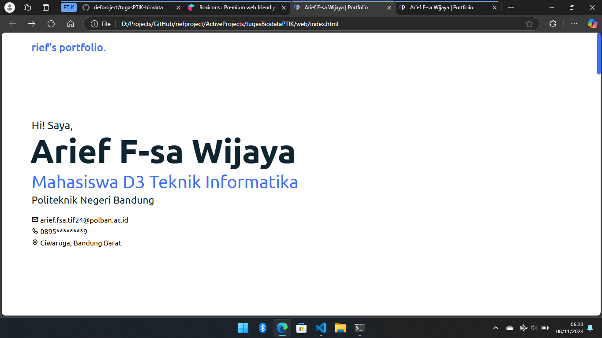
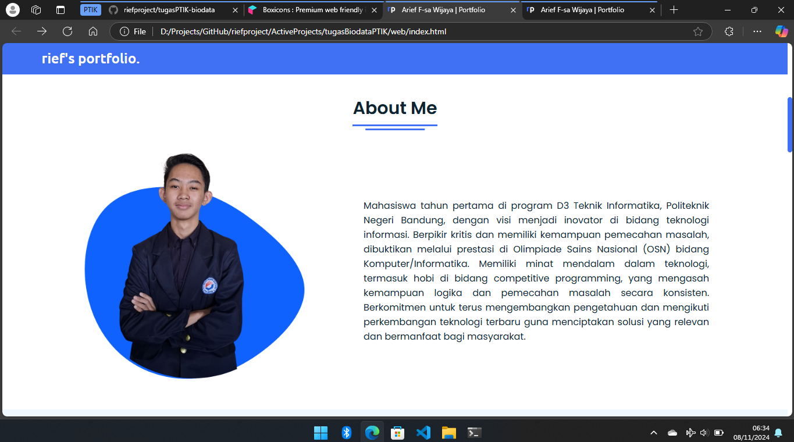
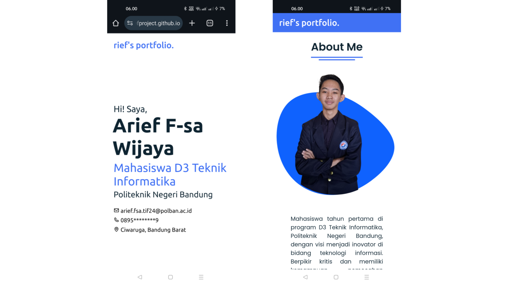

Lihat Halaman? [Klik di sini.](https://riefproject.github.io/tugasPTIK-Portfolio)

# Portfolio Website

Website ini dibuat untuk menampilkan biodata saya sebagai seorang mahasiswa D3 Teknik Informatika Politeknik Negeri Bandung. Website ini dibuat untuk memenuhi penugasan mata kuliah Pengantar Teknologi Informasi dan Komunikasi.

## Fitur

-   **About Me**: Halaman yang menjelaskan tentang diri saya dan visi sebagai mahasiswa Teknik Informatika
-   **My Skills**: Menampilkan keterampilan teknis dan pencapaian
-   **Educational Background**: Timeline pendidikan
-   **Achievement**: Prestasi yang diraih
-   **Experience**: Pengalaman organisasi
-   **Contact**: Informasi untuk berkomunikasi
-   Desain responsif yang dapat diakses di berbagai perangkat

## Struktur Proyek

```
web/
├── index.html
├── src/
│   ├── css/
│   │   └── style.css
│   ├── js/
│   │   └── script.js
│   └── img/
│       ├── saya.png
│       ├── osn.png
│       └── biossmansa.png
```

## Teknologi yang Digunakan

-   **HTML5** - Struktur website
-   **CSS3** - Styling dan responsive design
-   **JavaScript** - Interaktivitas dan sticky navigation
-   **Dependencies:**
    -   Boxicons (CDN)

## Cara Pengembangan

1. Clone repository

```bash
git clone https://github.com/riefproject/tugasPTIK-Portfolio.git
```

2. Buka folder proyek

```bash
cd tugasPTIK-Portfolio
```

3. Buka `index.html` di browser atau gunakan live server

## Cara Melihat Proyek

1. Kunjungi: [https://riefproject.github.io/tugasPTIK-Portfolio](https://riefproject.github.io/tugasPTIK-Portfolio)
2. Website akan terbuka di browser.

## Cuplikan Layar

### Tampilan Desktop

<div style="text-align:center">
    
    
</div>

### Tampilan Mobile

<div style="text-align:center">
    
</div>

## JavaScript Features

```javascript
// Sticky Navigation
window.onscroll = function () {
    if (document.documentElement.scrollTop > 20) {
        nav.classList.add("sticky");
    } else {
        nav.classList.remove("sticky");
    }
};
```

## Styling Guide

-   Warna utama: #2b65f8
-   Font : Sistem font default
-   Icons: Kombinasi Font Boxicons

## Credits

-   Font dari Google Fonts
-   Icon dari Font Boxicons

---

© 2024 riefproject. All rights reserved.
